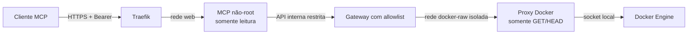

# VPS Observer MCP

MCP remoto e somente leitura para observar containers Docker explicitamente autorizados. O desenho prioriza redução de privilégio: o processo exposto à rede não recebe shell, filesystem da VPS, credenciais de banco nem acesso ao socket Docker.

> Segurança absoluta não pode ser garantida por nenhum projeto. Esta versão elimina as falhas críticas identificadas, adota defaults fechados e registra em [SECURITY.md](SECURITY.md) as premissas e os riscos residuais que precisam ser operados.

## Arquitetura



As redes `docker-observe` e `docker-raw` são internas e distintas. O MCP não consegue alcançar o proxy do socket. O gateway só oferece listagem filtrada e, quando habilitado explicitamente, logs limitados. O proxy bloqueia todos os métodos mutáveis mesmo se o gateway for comprometido.

## Ferramentas expostas

- `docker_containers`: estado dos containers presentes em `ALLOWED_CONTAINERS`.
- `runtime_info`: métricas não sensíveis do runtime isolado do MCP.
- `docker_logs`: opt-in com `ENABLE_DOCKER_LOGS=true`; desativada por padrão porque logs podem conter segredos e prompt injection.

Não existem ferramentas de shell, `docker exec`, start/stop/restart, deploy, escrita/leitura arbitrária de arquivos ou SQL livre.

## Subida local/na VPS

Pré-requisitos: Docker com Compose e uma rede externa `web` já usada pelo Traefik.

1. Gere um token com pelo menos 256 bits de entropia:

   ```bash
   openssl rand -base64 48
   ```

2. Guarde o token somente no cliente MCP. Calcule seu hash sem adicionar quebra de linha:

   ```bash
   printf '%s' 'COLE_AQUI_O_TOKEN' | sha256sum
   ```

3. Copie `.env.example` para `.env` e preencha:

   - `AUTH_TOKEN_SHA256`: apenas os 64 caracteres hexadecimais do hash;
   - `MCP_DOMAIN`: domínio exato servido pelo Traefik;
   - `ALLOWED_CONTAINERS`: nomes exatos obtidos com `docker ps --format '{{.Names}}'`;
   - `MCP_ALLOWED_ORIGINS`: vazio para rejeitar todos os Origins, ou Origins HTTPS exatos para clientes web.

4. Valide e inicie:

   ```bash
   docker compose config --quiet
   docker compose up -d --build
   docker compose ps
   ```

O endpoint remoto é `https://SEU_DOMINIO/mcp` e cada chamada deve enviar `Authorization: Bearer SEU_TOKEN`. O Traefik publica somente `/mcp`; os healthchecks ficam internos.

Para produção, substitua as imagens locais em `.env` pelas referências imutáveis por digest geradas após o pipeline, por exemplo `ghcr.io/empresa/vps-mcp@sha256:...`.

## Rotação do token

`AUTH_TOKEN_SHA256` aceita hashes separados por vírgula. Adicione o hash novo, recrie somente o serviço MCP, migre o cliente e depois remova o hash antigo. Essa sobreposição evita indisponibilidade sem manter o token em texto puro no servidor.

## Validação

```bash
npm ci --ignore-scripts
npm audit --omit=dev --audit-level=low
npm run check
npm test
docker compose config --quiet
docker build --target mcp-runtime -t vps-observer-mcp:test .
docker build --target gateway-runtime -t vps-observer-gateway:test .
```

O CI repete testes e auditoria, constrói as duas imagens, bloqueia vulnerabilidades altas/críticas e publica SBOM e proveniência. As ações do GitHub e a imagem do proxy Docker estão fixadas por SHA/digest.

## Resumo para apresentação

O ponto principal é a contenção de impacto. Antes, um único token liberava comandos arbitrários e o socket Docker, equivalentes a root na VPS. Agora o serviço externo é somente leitura, roda sem privilégios e atravessa duas barreiras internas: uma allowlist por container e um proxy que bloqueia mutações. Entradas, Host, Origin, autenticação, taxa, payloads, timeouts e outputs são limitados; dependências e imagens passam por verificação automatizada.
