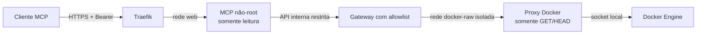

# VPS Observer MCP

MCP remoto e somente leitura para observar containers Docker explicitamente autorizados. O desenho prioriza redução de privilégio: o processo exposto à rede não recebe shell, filesystem da VPS, credenciais de banco nem acesso ao socket Docker.

> Segurança absoluta não pode ser garantida por nenhum projeto. Esta versão elimina as falhas críticas identificadas, adota defaults fechados e registra em [SECURITY.md](SECURITY.md) as premissas e os riscos residuais que precisam ser operados.

## Arquitetura


```mermaid
flowchart LR
    C[Cliente MCP] -->|HTTPS + Bearer| T[Traefik]
    T -->|rede web| M[MCP não-root<br/>somente leitura]
    M -->|API interna restrita| G[Gateway com allowlist]
    G -->|rede docker-raw isolada| P[Proxy Docker<br/>somente GET/HEAD]
    P -->|socket local| D[Docker Engine]
```

As redes `docker-observe` e `docker-raw` são internas e distintas. O MCP não consegue alcançar o proxy do socket. O gateway só oferece listagem filtrada e, quando habilitado explicitamente, logs limitados. O proxy bloqueia todos os métodos mutáveis mesmo se o gateway for comprometido.

## Ferramentas expostas

- `docker_containers`: estado dos containers presentes em `ALLOWED_CONTAINERS`.
- `runtime_info`: métricas não sensíveis do runtime isolado do MCP.
- `docker_logs`: opt-in com `ENABLE_DOCKER_LOGS=true`; desativada por padrão porque logs podem conter segredos e prompt injection.

Não existem ferramentas de shell, `docker exec`, start/stop/restart, deploy, escrita/leitura arbitrária de arquivos ou SQL livre.

## Subida local/na VPS

Pré-requisitos: Docker com Compose e uma rede externa `web` já usada pelo Traefik.

1. Gere um token com pelo menos 256 bits de entropia:

   ```bash
   openssl rand -base64 48
   ```

2. Guarde o token somente no cliente MCP. Calcule seu hash sem adicionar quebra de linha:

   ```bash
   printf '%s' 'COLE_AQUI_O_TOKEN' | sha256sum
   ```

3. Copie `.env.example` para `.env` e preencha:

   - `AUTH_TOKEN_SHA256`: apenas os 64 caracteres hexadecimais do hash;
   - `MCP_DOMAIN`: domínio exato servido pelo Traefik;
   - `ops-allowlist.json`: embutido na imagem no build; libere containers, comandos e caminhos editando o arquivo no repositório (push → CI → `docker compose pull`);
   - `MCP_ALLOWED_ORIGINS`: vazio para rejeitar todos os Origins, ou Origins HTTPS exatos para clientes web.

4. Valide, autentique no GHCR e suba:

   ```bash
   docker compose config --quiet
   printf '%s' 'SEU_PAT_READ_PACKAGES' | docker login ghcr.io -u SEU_USER --password-stdin
   docker compose pull
   docker compose up -d
   docker compose ps
   ```

   O pacote `vps-mcp` no GHCR é privado por padrão; sem login o `pull` falha. Se preferir
   pular o login, marque o pacote como público em
   `https://github.com/users/SEU_USER/packages/container/vps-mcp`.

Na VPS de produção o diretório fica enxuto — só o Compose e o `.env`:

```
/opt/vps-mcp/
├── docker-compose.yml
└── .env
```

O código vive no GitHub, o GitHub Actions constrói e publica a imagem e a VPS apenas
faz `docker compose pull`. Em desenvolvimento local, construa a imagem no host e
aponte `MCP_IMAGE=vps-observer-mcp:local` no `.env`.

O endpoint remoto é `https://SEU_DOMINIO/mcp` e cada chamada deve enviar `Authorization: Bearer SEU_TOKEN`. O Traefik publica somente `/mcp`; os healthchecks ficam internos.

Para releases imutáveis, fixe em `.env` a referência por digest gerada após o pipeline, por exemplo `MCP_IMAGE=ghcr.io/1arley/vps-mcp@sha256:...` (o workflow publica tags por SHA e `latest`, com SBOM e proveniência).

## Rotação do token

`AUTH_TOKEN_SHA256` aceita hashes separados por vírgula. Adicione o hash novo, recrie somente o serviço MCP, migre o cliente e depois remova o hash antigo. Essa sobreposição evita indisponibilidade sem manter o token em texto puro no servidor.

## Validação

```bash
npm ci --ignore-scripts
npm audit --omit=dev --audit-level=low
npm run check
npm test
docker compose config --quiet
docker build --target mcp-runtime -t vps-observer-mcp:test .
```

O CI repete testes e auditoria, constrói a imagem do MCP, bloqueia vulnerabilidades
altas/críticas com correção disponível (as sem correção no base bookworm são
ignoradas pelo gate) e publica a imagem no GHCR com SBOM e proveniência. As ações
do GitHub e a imagem base Node estão fixadas por SHA/digest.

## Resumo para apresentação

O ponto principal é a contenção de impacto. Antes, um único token liberava comandos arbitrários e o socket Docker, equivalentes a root na VPS. Agora o serviço externo é somente leitura, roda sem privilégios e atravessa duas barreiras internas: uma allowlist por container e um proxy que bloqueia mutações. Entradas, Host, Origin, autenticação, taxa, payloads, timeouts e outputs são limitados; dependências e imagens passam por verificação automatizada.
