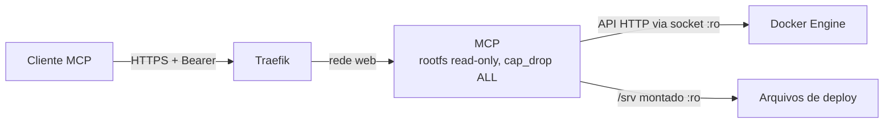

# VPS Observer MCP

MCP remoto para observar e operar containers Docker autorizados. O servidor fica atrás do Traefik com autenticação por bearer, checagem de Host/Origin e rate limit. Não há gateway nem proxy intermediário: o MCP fala direto com a API do Docker pelo socket montado somente leitura, e **cada ferramenta é governada pelo `ops-allowlist.json`**, que decide o que é permitido.

> Segurança absoluta não pode ser garantida por nenhum projeto. Esta versão registra em [SECURITY.md](SECURITY.md) as premissas, os controles aplicados e os riscos residuais que precisam ser operados.

## Arquitetura


```mermaid
flowchart LR
    C[Cliente MCP] -->|HTTPS + Bearer| T[Traefik]
    T -->|rede web| M[MCP<br/>rootfs read-only, cap_drop ALL]
    M -->|API HTTP via socket :ro| D[Docker Engine]
    M -->|/srv montado :ro| S[Arquivos de deploy]
```

O `docker-compose.yml` concentra a contenção: rootfs `read_only`, `cap_drop: ALL`,
`no-new-privileges`, `pids_limit`/`mem_limit`/`cpus`, socket e `/srv` montados `:ro`
e Traefik publicando somente `/mcp`. O mount `:ro` do socket protege o arquivo, não
a API — a autorização real de cada operação vem da allowlist consultada pela tool.

## Ferramentas expostas

Leitura (filtradas pela allowlist):

- `docker_containers` / `docker_ps`: listagem de containers por `docker.containers`.
- `docker_logs`: logs limitados de um container em `docker.containers` — conteúdo
  marcado como não confiável (pode conter segredos ou prompt injection).
- `read_file` / `list_dir`: caminhos em `files.read` / `files.list`.
- `pg_query`: `pg.hosts` + `pg.databases`.
- `runtime_info` / `system_info`: métricas do processo e da VPS, sem parâmetros.

Operação (allowlist decide, e o padrão do repositório é `*`):

- `shell`: comandos em `shell.patterns`.
- `docker_exec`: `{ name, command }` em `docker.exec`.
- `docker_start` / `docker_stop` / `docker_restart`: containers em `docker.containers`.
- `write_file`: caminhos em `files.write`.
- `deploy`: `git pull` + ação em `deploy.dirs`.

Toda chave ausente ou array vazio **nega**. A allowlist padrão é liberada porque o
modelo é operador único — para limitar, veja
[Restringir permissões na VPS](#restringir-permissões-na-vps-opcional).

## Subida local/na VPS

Pré-requisitos: Docker com Compose e uma rede externa `web` já usada pelo Traefik.

1. Gere um token com pelo menos 256 bits de entropia:

   ```bash
   openssl rand -base64 48
   ```

2. Guarde o token somente no cliente MCP. Calcule seu hash sem adicionar quebra de linha:

   ```bash
   printf '%s' 'COLE_AQUI_O_TOKEN' | sha256sum
   ```

3. Copie `.env.example` para `.env` e preencha:

   - `AUTH_TOKEN_SHA256`: apenas os 64 caracteres hexadecimais do hash;
   - `MCP_DOMAIN`: domínio exato servido pelo Traefik;
   - `ops-allowlist.json`: embutido na imagem no build (padrão liberado, `*`); para limitar as permissões na VPS monte seu próprio arquivo por cima — veja [Restringir permissões na VPS](#restringir-permissões-na-vps-opcional);
   - `MCP_ALLOWED_ORIGINS`: vazio para rejeitar todos os Origins, ou Origins HTTPS exatos para clientes web.

4. Valide e suba:

   ```bash
   docker compose config --quiet
   docker compose pull
   docker compose up -d
   docker compose ps
   ```

   O pacote `vps-mcp` no GHCR é público, então o `pull` é anônimo — nenhum login
   ou PAT é necessário. Para voltar a privar, marque o pacote como privado em
   `https://github.com/users/1arley/packages/container/vps-mcp/settings` e faça
   `docker login ghcr.io` na VPS com um PAT de `read:packages`.

Na VPS de produção o diretório fica enxuto — só o Compose e o `.env`:

```
/opt/vps-mcp/
├── docker-compose.yml
└── .env
```

O código vive no GitHub, o GitHub Actions constrói e publica a imagem e a VPS apenas
faz `docker compose pull`. Em desenvolvimento local, construa a imagem no host e
aponte `MCP_IMAGE=vps-observer-mcp:local` no `.env`.

O endpoint remoto é `https://SEU_DOMINIO/mcp` e cada chamada deve enviar `Authorization: Bearer SEU_TOKEN`. O Traefik publica somente `/mcp`; os healthchecks ficam internos.

## Link para o agente MCP

O que se entrega ao cliente/agente é exatamente esta URL + o bearer:

```
URL:        https://SEU_DOMINIO/mcp
Header:     Authorization: Bearer SEU_TOKEN
Transporte: streamable HTTP (sem SSE separado)
```

Config JSON típico de um cliente MCP remoto (`mcpServers`):

```json
{
  "mcpServers": {
    "vps-observer": {
      "type": "http",
      "url": "https://SEU_DOMINIO/mcp",
      "headers": {
        "Authorization": "Bearer SEU_TOKEN"
      }
    }
  }
}
```

Checklist de sanidade antes de entregar o link:

```bash
# sem token → 401
curl -i https://SEU_DOMINIO/mcp
# com token → 200/202 e handshake MCP
curl -i -X POST https://SEU_DOMINIO/mcp \
  -H 'Authorization: Bearer SEU_TOKEN' \
  -H 'Content-Type: application/json' \
  -H 'Accept: application/json, text/event-stream' \
  -d '{"jsonrpc":"2.0","id":1,"method":"initialize","params":{"protocolVersion":"2025-06-18","capabilities":{},"clientInfo":{"name":"smoke","version":"1.0"}}}'
```

Hosts e Origins aceitos vêm de `MCP_ALLOWED_HOSTS` / `MCP_ALLOWED_ORIGINS` no `.env`;
cliente nativo sem `Origin` é aceito, Origin errado é rejeitado antes do MCP.

Para releases imutáveis, fixe em `.env` a referência por digest gerada após o pipeline, por exemplo `MCP_IMAGE=ghcr.io/1arley/vps-mcp@sha256:...` (o workflow publica tags por SHA e `latest`, com SBOM e proveniência).

## Restringir permissões na VPS (opcional)

A allowlist embutida na imagem (`ops-allowlist.json`) é propositalmente liberada
(`"*"` em shell, docker, files e pg) — feita para um único operador que confia na
própria VPS. Se você quiser limitar o que o MCP pode fazer, **não é preciso
rebuildar a imagem**: monte seu próprio arquivo por cima do embutido.

1. Crie o arquivo ao lado do Compose:

   `/opt/vps-mcp/ops-allowlist.json`

   ```json
   {
     "shell": { "patterns": ["docker ps*", "docker logs*"] },
     "docker": {
       "containers": ["meu-app", "postgres-1"],
       "exec": [{ "name": "postgres-1", "command": "pg_isready*" }]
     },
     "files": { "read": ["/srv/**"], "write": [], "list": ["/srv"] },
     "pg": { "hosts": ["postgres"], "databases": ["app"] },
     "deploy": { "dirs": ["/srv/meu-projeto"] }
   }
   ```

2. Monte no serviço `mcp` do `docker-compose.yml` (o caminho precisa ser o de
   `OPS_ALLOWLIST_PATH`, default `/app/ops-allowlist.json`):

   ```yaml
   services:
     mcp:
       volumes:
         - /var/run/docker.sock:/var/run/docker.sock:ro
         - ./ops-allowlist.json:/app/ops-allowlist.json:ro
         - /srv:/srv:ro
   ```

3. Recrie o serviço e pronto:

   ```bash
   docker compose up -d
   ```

   Depois disso, editar o arquivo exige só `docker compose restart mcp` — a
   allowlist é lida uma vez na subida do processo.

Semântica de cada chave (glob simples com `*`):

| Chave | O que libera |
| --- | --- |
| `shell.patterns` | comandos bash passados à tool `shell` |
| `docker.containers` | containers visíveis em `docker_containers`, `docker_ps` e `docker_logs`, e alvos de `docker_start` / `docker_stop` / `docker_restart` |
| `docker.exec` | regras `{ "name", "command" }` para `docker_exec` (ambos glob) |
| `files.read` / `files.write` / `files.list` | caminhos de `read_file` / `write_file` / `list_dir` |
| `pg.hosts` / `pg.databases` | destinos de `pg_query` |
| `deploy.dirs` | diretórios do `deploy` (`git pull` + ação) |

Tudo é **negado por padrão**: chave ausente ou array vazio nega; `"*"` libera tudo;
qualquer permissão nova negada pelo servidor vem com o texto `Adicione ao
ops-allowlist.json e reinicie o MCP`. Com o volume montado a VPS passa a ter 3
arquivos (`docker-compose.yml`, `.env` e `ops-allowlist.json`).

## Rotação do token

`AUTH_TOKEN_SHA256` aceita hashes separados por vírgula. Adicione o hash novo, recrie somente o serviço MCP, migre o cliente e depois remova o hash antigo. Essa sobreposição evita indisponibilidade sem manter o token em texto puro no servidor.

## Validação

```bash
npm ci --ignore-scripts
npm audit --omit=dev --audit-level=low
npm run check
npm test
docker compose config --quiet
docker build --target mcp-runtime -t vps-observer-mcp:test .
```

O CI repete testes e auditoria, constrói a imagem do MCP, bloqueia vulnerabilidades
altas/críticas com correção disponível (as sem correção no base bookworm são
ignoradas pelo gate) e publica a imagem no GHCR com SBOM e proveniência. As ações
do GitHub e a imagem base Node estão fixadas por SHA/digest.

## Resumo para apresentação

O ponto principal é a contenção de impacto. O acesso externo é um único endpoint
`/mcp` atrás do Traefik, com token de 256 bits, checagem de Host/Origin, rate limit
e limites de body/output/logs. O container roda com rootfs read-only, sem
capabilities, com limites de CPU/memória/PIDs, e **cada ferramenta passa pela
allowlist** (`ops-allowlist.json`), que nega por padrão — o arquivo do repositório
é o liberado (`*`), pensado para operador único e substituível por volume na VPS.
No CI, `npm audit` e Trivy bloqueiam vulnerabilidades com correção disponível, e a
imagem vai para o GHCR com SBOM e proveniência.
